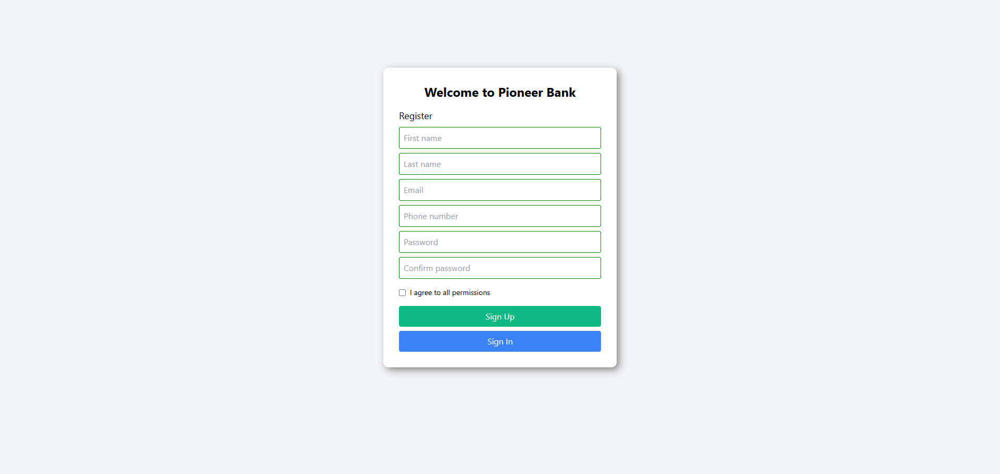

<<<<<<< HEAD
# Bank

##### It seems like you're asking for a coding example related to a "bKash" application, possibly for a mobile interface or a responsive design that could be suitable for a device like a Redmi phone. Below, I'll provide you with a simple HTML structure styled with Tailwind CSS that could represent a bKash-like application interface. This will include sections for login, registration, and transaction areas, all designed to be responsive and mobile-friendly.

- [Live Link](https://saidee-hasan.github.io/bkash-bank/) 

=======
# donate-Quter

>>>>>>> 966320df064c6901eb270fed18805bd7c021e478
